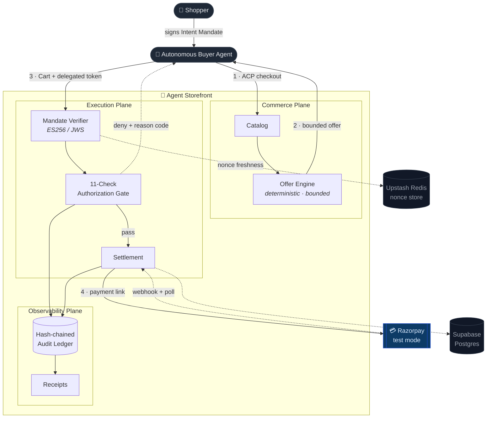
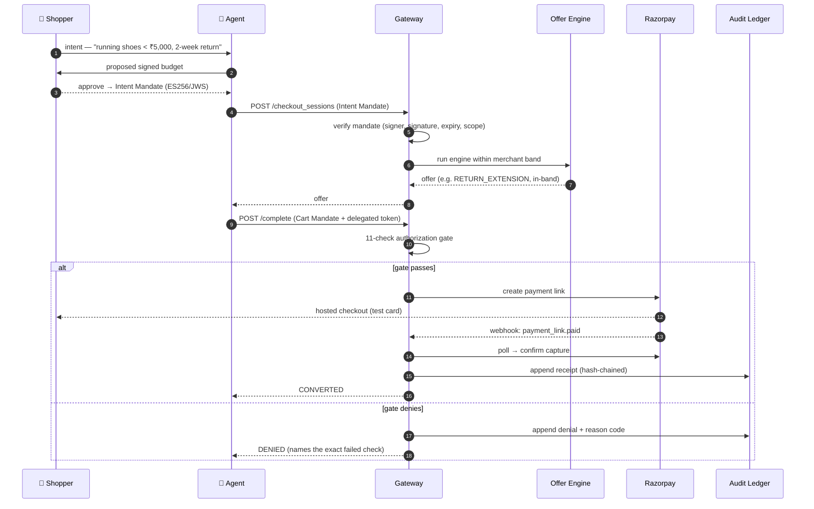

# Agent Storefront

**Make your Razorpay store sellable to AI agents — with cryptographically bounded authorization.**


Agent Storefront is a merchant-side gateway that makes a Razorpay merchant *transactable by autonomous AI buyers*. A shopper delegates a **signed, bounded mandate** to an agent; the agent shops the merchant's catalog; a deterministic **Offer Engine** recovers sales a passive store would lose — always inside the merchant's limits; and an 11-check **authorization gate** proves every settlement stayed within the buyer's signed intent before a rupee moves. Every action is written to a tamper-evident audit chain.

Today's checkout was designed for humans clicking buttons. As autonomous agents begin doing the buying, merchants need a way to be *legible and safe* to transact with — provably, not on trust. That's what this builds.

---

## Table of contents

- [Why it matters](#why-it-matters)
- [How it works](#how-it-works)
- [Architecture](#architecture)
- [The checkout lifecycle](#the-checkout-lifecycle)
- [The mandate protocol](#the-mandate-protocol)
- [The Offer Engine](#the-offer-engine)
- [The 11-check gate](#the-11-check-authorization-gate)
- [The audit chain](#the-audit-chain)
- [Data model](#data-model)
- [Tech stack](#tech-stack)
- [The console](#the-console)
- [Quickstart](#quickstart)
- [Tests](#tests)
- [Assumptions & limitations](#assumptions)
- [Repository layout](#repository-layout)

---

## Why it matters

- **The problem.** An autonomous buyer can't be handed a raw checkout — it could be manipulated, overspend, or accept terms the shopper never agreed to. And a merchant can't tell a legitimate agent from an abusive one.
- **The idea.** Authorization becomes a *signed mandate* with hard bounds. The agent may act freely, but only inside those bounds; the gateway verifies and enforces them; and the merchant can still *win the sale* by making a bounded counter-offer the agent can accept.
- **The novelty.** The **Offer Engine** — a deterministic, provably-bounded recovery mechanism that turns "no deal" into a closed sale (a return-window extension, an expedited-shipping upgrade, an accretive bundle, or a budget-capped discount) without ever breaching the merchant's margin floor or the buyer's ceiling.

---

## How it works

At a glance, one transaction flows through three planes:

1. **Consent** — the shopper signs an Intent Mandate that authorizes an agent to spend within hard bounds (category, ceiling, freshness).
2. **Commerce** — the agent shops the catalog; the Offer Engine computes the best *legal* offer, recovering near-miss sales within the merchant's band.
3. **Execution** — the agent submits a signed cart + delegated token; the 11-check gate authorizes it; settlement fires on Razorpay.
4. **Observability** — every decision (pass or deny) is appended to a hash-chained ledger; receipts are verifiable and tamper-evident.

The load-bearing invariant: **no language model ever touches a money decision.** The gate and the engine are fully deterministic; the LLM is confined to the buyer stand-in and human-readable narration. All money is integer **paise** — no floats anywhere in the value path.

---

## Architecture



- **Commerce plane** — the merchant catalog and the deterministic Offer Engine.
- **Execution plane** — mandate verification, the 11-check authorization gate, and settlement.
- **Observability plane** — a hash-chained audit ledger and verifiable receipts.

---

## The checkout lifecycle



---

## The mandate protocol

Agent Storefront uses **AP2-shaped mandates**, signed **ES256 (JWS)**, chained from the shopper's consent down to settlement:

| Mandate | Signed by | Carries | Purpose |
|---------|-----------|---------|---------|
| **Intent Mandate** | the **user wallet** (enforced) | category, spending ceiling, min-return, delivery, quantity, allowed merchants, nonce, expiry | the shopper's bounded consent — the root of trust |
| **Cart Mandate** | the agent | the exact cart, its hash, and the session it belongs to | binds a priced cart to one session |
| **Delegated token** | the merchant scope | token scope + expiry | authorizes settlement against the cart |

Only the **user role** may originate an Intent Mandate — an agent or merchant cannot forge its own permission (verified *before* the signature check). Mandates are nonce-fresh (single-use, replay-proof via Redis) and TTL-bounded so they can't outlive the replay window.

---

## The Offer Engine

The engine's job: when a straightforward "yes" isn't possible, find the best **legal** counter-offer that closes the sale — or honestly return no-offer. It is pure and deterministic (same inputs → same output, always), and every candidate is validated against the merchant's **band** before it can win.

| Lever | What it does | Bounded by |
|-------|--------------|-----------|
| `AS_IS` | sell at listed/effective price | buyer ceiling, margin floor |
| `RETURN_EXTENSION` | extend the return window to meet the buyer | `return_band_max_days`; cost = `20 bps/day` |
| `SHIPPING_UPGRADE` | expedite delivery | `shipping_upgrade_max_cost_paise` (flat ₹80) |
| `BUNDLE` | accretive upsell (e.g. socks) that raises absolute margin | must lift margin; addon category allow-list |
| `DISCOUNT` | budget-capped price concession | `discount_budget_bps` on list |
| `MULTI` | a combination of the above | all of the above, jointly |

**Anti-stacking (three layers).** (1) A single `discount_budget_bps` caps the *sum* of all price concessions on list — not per-source. (2) Pricing is promo-aware; by default the engine won't stack an engine discount on a standing promo. (3) The gate independently recomputes realized margin on the *actually captured* amount, so a coupon slipped in at checkout is caught as a margin-floor breach. A concession the engine can't make legally is never offered — it returns a bounded no-offer instead.

---

## The 11-check authorization gate

Every settlement clears these checks, **in this order** (the order is load-bearing and covered by tests). A denial names the exact check that fired, from a fixed reason-code taxonomy.

| # | Check | Fails when… |
|---|-------|-------------|
| 1 | `MANDATE_VERIFIED` | the Intent Mandate is structurally invalid |
| 2 | `SIGNATURE_OK` | the JWS signature doesn't verify against the pinned signer |
| 3 | `NOT_EXPIRED` | the mandate is past expiry (or beyond max TTL) |
| 4 | `NONCE_FRESH` | the nonce was already used (replay) |
| 5 | `SCOPE_OK` | merchant/category is outside the mandate's scope |
| 6 | `WITHIN_MANDATE_CEILING` | the cart exceeds the buyer's signed ceiling |
| 7 | `WITHIN_MERCHANT_BAND` | the offer breaches the merchant's margin/return/discount band |
| 8 | `CART_INTEGRITY` | the cart hash doesn't match what was priced |
| 9 | `INVENTORY_CONSISTENT` | stock/version drifted |
| 10 | `TOKEN_SCOPE_OK` | the delegated token doesn't authorize this cart |
| 11 | `IDEMPOTENT` | this settlement was already processed |

---

## The audit chain

Every gate decision, offer, and settlement is appended to a **hash-chained ledger**: each row's hash includes the previous row's hash, so any tampering breaks the chain at a detectable sequence number. Receipts are built from this chain and are independently verifiable. The merchant surface never exposes the buyer's private reasoning — provenance is **request-and-reveal**: raised for a dispute, reconstructed and verified for that case, not sitting in a dashboard.

---

## Data model

Postgres (Supabase), managed by Alembic. Conceptually:

- **Merchant & catalog** — `merchant`, `merchant_config` (the versioned band), `product`.
- **Mandates & authorization** — `intent_mandate`, `authorization`, `cart_mandate`, delegated tokens.
- **Sessions & offers** — `session` (scoped to its merchant), `offer`.
- **Settlement** — `payment`, `receipt`.
- **Observability** — `audit_log` (the hash chain).

The app connects via the Supabase **pooler** (transaction mode, prepared statements disabled); migrations use the **direct** connection.

---

## Tech stack

| Layer | Choice |
|-------|--------|
| Backend | Python · FastAPI |
| Database | Supabase Postgres (pooler for the app; direct for migrations) |
| Cache / nonce store | Upstash Redis |
| Payments | Razorpay (test mode) — Payment Link + webhook + reconciling poll |
| Agent / narration | Google Gemini (buyer stand-in and narration only) |
| Frontend | Next.js 14 (App Router) · TypeScript · Tailwind CSS · Recharts |
| Crypto | ES256 / JWS mandates (`python-jose`, `cryptography`) |

---

## The console

One app, three role-scoped surfaces (switch role from the top-left):

- **Merchant** — home & analytics (recovered revenue, conversion funnel, lever effectiveness, margin distribution), catalog (single onboard **or bulk CSV import**), offers, transactions, disputes (request-and-reveal audit trail), reports, and a band editor with a live offer-envelope preview.
- **Rail** (the Razorpay-side view) — authorization overview, sessions, the gate log, webhooks & events, and a provenance explorer over the audit chain.
- **Buyer** — a chat where a shopper states intent, confirms a signed budget, and watches the agent transact turn-by-turn on the real rails.

---

## Quickstart

Prerequisites: Python 3.12, Node 20, and a `.env` (copy `.env.example`).

```bash
# 1. backend
python -m venv venv && source venv/bin/activate
pip install -r requirements.txt
python data/generate_keys.py          # ES256 mandate keypairs (git-ignored)
alembic upgrade head                  # apply schema (use the DIRECT Supabase URL)
uvicorn backend.api.main:app --reload --port 8000

# 2. frontend
cd frontend
cp .env.local.example .env.local
npm install
npm run dev                           # http://localhost:3000
```

Point `.env` at your Supabase, Upstash, Gemini, and **Razorpay test-mode** credentials. Configure the Razorpay webhook per `docs/setup/WEBHOOK_SETUP.md`. Full setup: `docs/setup/SETUP_GUIDE.md`.

### Seed a catalog
Import [`data/demo-catalog.csv`](data/demo-catalog.csv) from **Merchant → Products → Import CSV** — 12 SKUs tuned so every Offer-Engine lever is reachable.

---

## Tests

```bash
pytest backend/tests/unit backend/gateway/tests -q
```

The unit and gateway suites are pure and DB-free (they run in CI on every push). Integration tests exercise live Supabase/Razorpay and are excluded from CI by design.

---

## Assumptions

- **Test mode.** The system targets Razorpay **test mode**; all keys, cards, and captures are sandbox.
- **One buyer, one merchant per session.** A single delegating shopper and the merchant's own isolated catalog; multi-tenant fan-out is out of scope.
- **The buyer agent is a stand-in.** An LLM-backed buyer (Gemini) plays the autonomous shopper. Its *decisions never touch the gate* — the gate authorizes against the signed mandate, not against anything the buyer model says.
- **Catalog is merchant-supplied.** Products, costs, and the merchant band are provided by the merchant; the engine optimizes strictly within them.

## Limitations (honest)

- **Buyer-side mandate is delegated, not federated.** The shopper signs an Intent Mandate that bounds the agent; we don't implement a full external wallet/identity federation. The consent model is real (user-role signer enforced, bounded ceiling, nonce-fresh), but issuance is local to the demo.
- **Settlement uses a Payment Link, not server-to-server (S2S).** True hands-free settlement — the agent presenting a delegated payment credential and the gateway pulling funds S2S — requires S2S enablement, which needs a KYC-verified account and isn't available to a sandbox test account. We therefore hand the agent a Razorpay **Payment Link** and confirm capture via webhook + a reconciling poll. **The autonomy the problem asks for lives in the authorization plane** (mandate → offer → 11-check gate → delegated-token authorization), all of which runs with no human in the loop; the final card step is the sandbox stand-in for the S2S pull, and the delegated-token plumbing the gate authorizes against is built and tested.
- **Eventual consistency.** Razorpay reports a link "paid" slightly before the payment object is queryable; settlement defers capture until the payment id is visible, and a post-hoc reconcile flips any late payment to converted.
- **Scale.** Audit-trail reconstruction verifies the chain from genesis — correct-by-design, but not tuned past demo volume.

---

## Repository layout

```
backend/     FastAPI service — gateway, offer engine, audit chain, ACP, console API
frontend/    Next.js 14 console (merchant · rail · buyer)
alembic/     database migrations
scripts/     buyer-session runner, cart signer
data/        key generation, catalog utilities, demo-catalog.csv
docs/         PRD, TRD, setup guides, engineering log (decisions & errors)
```

## Documentation
- [`docs/PRD.md`](docs/PRD.md) — product requirements
- [`docs/TRD.md`](docs/TRD.md) — technical design (planes, gate, engine, audit chain)
- [`docs/setup/`](docs/setup/) — local setup and Razorpay webhook configuration
- [`docs/engineering-log/`](docs/engineering-log/) — decisions and a candid bug log

## License
[MIT](LICENSE).